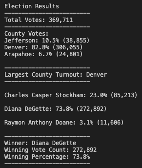
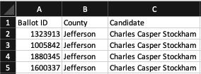

# Election_Analysis

## Overview of Election Audit
The purpose of this project was to process the data received from the Colorado Board of Elections from a congressional election. I was tasked with auditing the results to verify the election outcome and county turnout by performing the following tasks:

1. Calculate the total number of votes cast.
2. Get a complete list of candidates who received votes. 
3. Calculate the total number of votes each candidate received. 
4. Calculate the percentage of votes each candidate won.
5. Determine the winner of the election based on popular vote.
6. Get a complete list of counties that participated in the election.
7. Calculate the total number of votes cast per county.
8. Calculate the percentage of votes cast per county.
9. Determine the county with the highest voter turnout.

## Resources
-Data Source: election_results.csv

-Software: Python, Visual Studio Code

## Election-Audit Results
The audit revealed the following data:

There were 369,711 total votes cast.
  - The counties involved in the election were: Jefferson, Denver, Arapahoe
  - The county results were:
    - Jefferson County had 38,855 votes (10.5%)
    - Denver County had 306,055 votes (82.8%)
    - Arapahoe County had 24,801 votes (6.7%)
  - As evidenced above, Denver County had the largest number of votes
  - The candidates involved in the election were: Charles Casper Stockham, Diana DeGette, Raymon Anthony Doane-The candidate results were: 
    - Charles Casper Stockham: 23.0% (85,213 total votes)
    - Diana DeGette: 73.8% (272,892 total votes)
    - Raymon Anthony Doane: 3.1% (11, 606 total votes)
  - The election winner was Diane DeGette with 73.8% of the votes (272,892 total votes)

## Election-Audit Summary
This script can easily be used in future election audits by the Colorado Board of Elections or any other board of elections, congressional or otherwise. In order to use this script, the Board of Elections needs only to produce the raw results of the election outcomes in the same format where the county information is listed in the second column of the CSV file (row[1]) and the candidate name is listed in the third column of the CSV file (row[2]) as seen below. 

